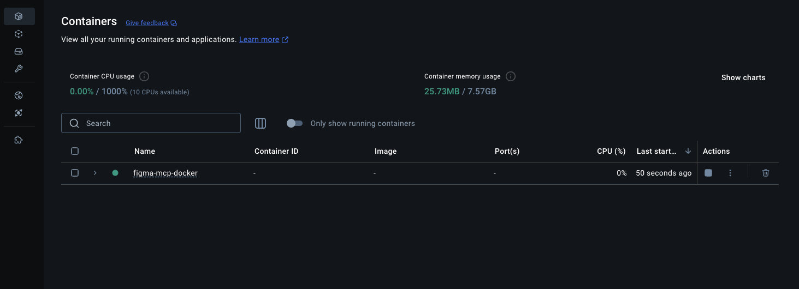
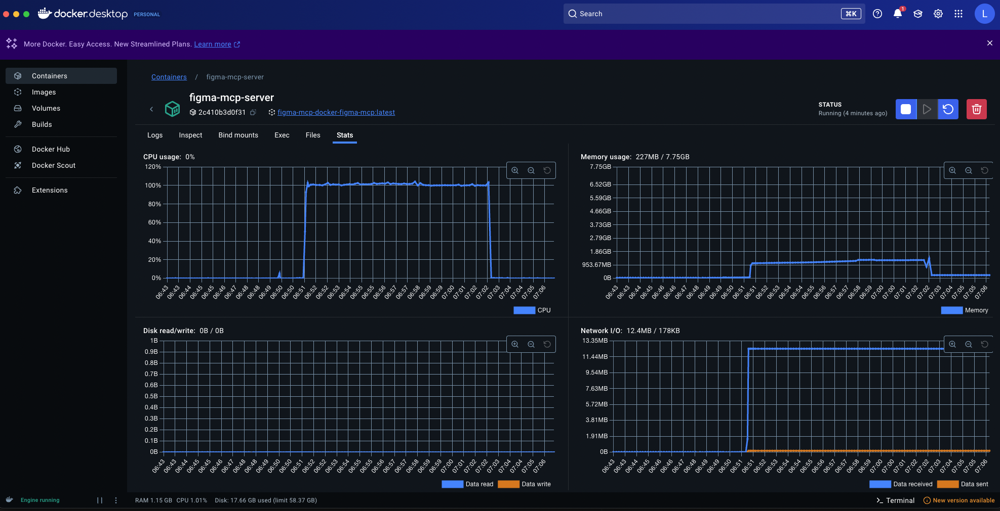

!!!

피그마 팀이 공식 Dev Mode MCP Server를 지원합니다(2025년 6월 5일 기준 오픈베타). 
키 발급, 외부 API 통신 없이, 피그마 데스크탑과 연동하면 마크업 작업이 가능합니다(`http://127.0.0.1:3845/sse`).
사용 방법은 곧 작성하여 링크 달아두겠습니다.

!!!

# Docker로 Figma MCP 설정하기

- [Framelink Figma MCP](https://github.com/GLips/Figma-Context-MCP)를 Docker를 사용하여 실행하고, VS Code와 연동하는 방법을 설명합니다.

## 저장소 클론

```bash
git clone https://github.com/Violet-Bora-Lee/framelink-figma-mcp-docker.git
```

- 폴더 구조

  ```plaintext
  figma-mcp-docker/
  ├── Dockerfile
  ├── docker-compose.yml
  ├── .env.example
  └── .env
  ```

## 2. 설정 단계

### 환경 변수 설정

1. `.env.example`을 `.env`로 복사

    ```bash
    cp .env.example .env
    ```

2. `.env` 파일에 실제 Figma API 키 입력

    ```plaintext
    FIGMA_API_KEY=이곳에피그마개인키입력
    ```

### Docker 이미지 빌드 및 실행

> 사전 준비사항: Docker Desktop 실행

   - 다운로드 링크: https://www.docker.com/products/docker-desktop/

#### Docker Compose V2를 사용하는 경우 (권장)

1. Docker 이미지 빌드

    ```bash
    docker compose build
    ```

      - 정상 빌드시 로그에 ` ✔ Service figma-mcp  Built` 출력됨

2. 컨테이너 백그라운드 실행

    ```bash
    docker compose up -d
    ```

      - 정상 실행시 로그에 다음과 같은 내용 출력됨

        ```plaintext
        ✔ Network figma-mcp-docker_default  Created 
        ✔ Container figma-mcp-server        Started
        ```  

1. 컨테이너 상태 확인

    3-1. 명령어로 확인

    ```bash
    docker compose ps
    ```

    - 정상 동작중이면 로그에 다음과 같은 내용 출력됨

      ```plaintext
      NAME               IMAGE                        COMMAND                   SERVICE     CREATED         STATUS         PORTS
      figma-mcp-server   figma-mcp-docker-figma-mcp   "docker-entrypoint.s…"   figma-mcp   2 minutes ago   Up 2 minutes   
      ```

    3-2. Docker Desktop에서 확인

    - Containers 메뉴에서 `figma-mcp-docker` 컨테이너가 실행 중임을 확인
        

#### Docker Compose가 없는 경우(직접 실행)

1. Docker 이미지 빌드

    ```bash
    docker build -t figma-mcp .
    ```

2. 컨테이너 실행

    2-1. (옵션1) `.env` 파일에서 환경 변수 로드하여 실행

    ```bash
    docker run -d --name figma-mcp-server \
      --env-file .env \
      -it figma-mcp
    ```

    2-2. (옵션2) 직접 환경 변수 지정

    ```bash
    docker run -d --name figma-mcp-server \
      -e FIGMA_API_KEY="your_figma_api_key_here" \
      -it figma-mcp
    ```

## 3. VSCode 설정

1. VSCode의 `settings.json`이나 워크스페이스의 `mcp.json`에 다음을 추가

    ```json
    {
        "servers": {
            "Framelink Figma MCP (Docker)": {
                "command": "docker",
                "args": [
                    "exec",
                    "-i",
                    "figma-mcp-server",
                    "/app/start.sh"
                ]
            }
        }
    }
    ```

2. GitHub Copilot Chat의 Agent 모드에서 MCP 연동 후 작업

## 5. 문제 해결

### 컨테이너 로그 확인

```bash
# Docker Compose V2
docker compose logs figma-mcp

# 또는 직접 Docker 명령어
docker logs figma-mcp-server
```

### 컨테이너 내부 접속

```bash
docker exec -it figma-mcp-server sh
```

### API 키 확인

```bash
docker exec figma-mcp-server env | grep FIGMA
```

## 주의사항

- MCP는 stdio 기반 통신을 사용하므로 포트 매핑이 필요하지 않습니다
- Docker 컨테이너가 실행 중이어야 VSCode에서 연결 가능합니다
- Figma API 키는 안전하게 관리해야 합니다
  - `.env` 파일로 키를 관리할 때는 `.gitignore`에 `.env` 추가하여 저장소에 올라가지 않도록 관리
  - 명령창에 키를 직접 입력하면 `history` 명령어로 키가 노출될 수 있으니 주의

### API 키 보안 추가 팁

**History 노출 방지:**

```bash
# 1. 명령어 앞에 공백을 넣으면 일부 쉘에서 history에 저장되지 않음
 docker run -e FIGMA_API_KEY="your_key" figma-mcp

# 2. 민감한 명령어 실행 후 즉시 history에서 삭제
docker run -e FIGMA_API_KEY="your_key" figma-mcp
history -d $(history 1)

# 3. 현재 세션의 history 저장 비활성화
set +o history
docker run -e FIGMA_API_KEY="your_key" figma-mcp
set -o history
```

**가장 안전한 방법:**

- 환경 변수 파일(`.env`) 사용이 가장 권장됨
- 키 관리 도구 사용 (AWS Secrets Manager, HashiCorp Vault 등)
- Docker secrets 활용 (Docker Swarm 환경)

## Docker를 사용한 MCP의 장점

- VS Code 내에서 MCP를 실행하는것보다 Docker를 사용해 MCP를 띄운 후 연동하는게 나은 이유
  - Docker Desktop의 대시보드를 통해 컨테이너의 CPU, 메모리 사용량, 네트워크 I/O, 디스크 R/W 등의 리소스를 실시간으로 모니터링할 수 있어 MCP 서버의 상태를 파악하고 문제를 진단하는 데 용이함
    
  - 로컬 환경에서 직접 `npx`를 사용해서 패키지를 실행할 때 발생할 수 있는 권한, 버전 충돌, 경로 문제 등으로 인한 설정 막힘 현상을 방지할 수 있음. Docker는 격리된 환경에서 필요한 모든 종속성을 포함하여 실행되므로, 일관되고 안정적인 MCP 서버 실행 환경을 제공함
